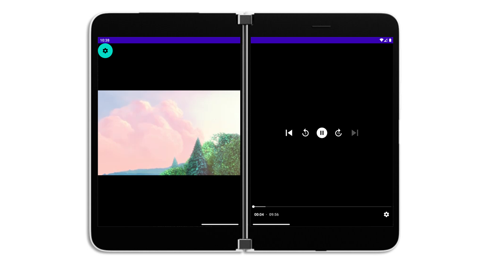
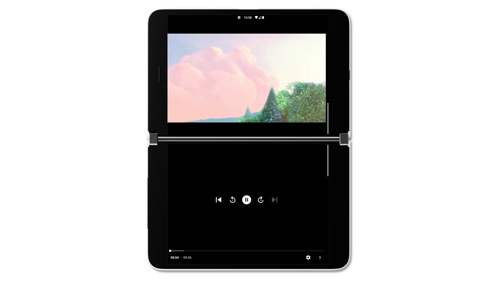

# FoldingVideo - Video with External Controls Sample

This sample app shows how video-playing apps can be adapted to dual-screen and foldable devices. When a video is cut off by a hinge or fold, you can separate the video and its controls onto separate halves of the device. By calculating the fold position with Jetpack Window Manager, we can use MotionLayout and ReactiveGuide to move the controls accordingly.

## Examples

In dual-portrait mode, we have the option to split the controls with a FloatingActionButton.

In dual-landscape mode, we always split the controls and leave the video on the top screen.
